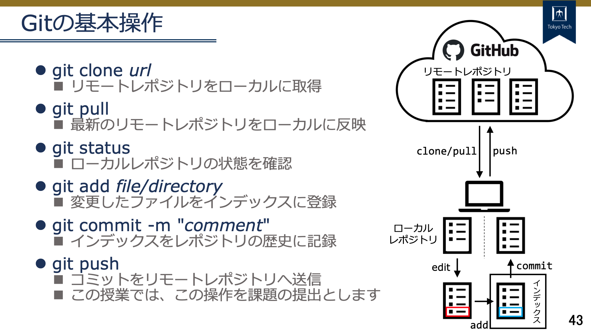
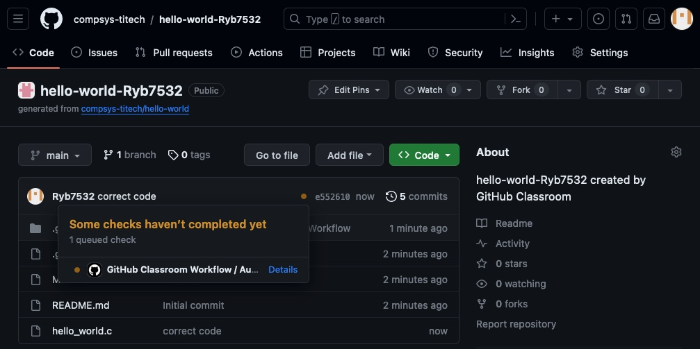
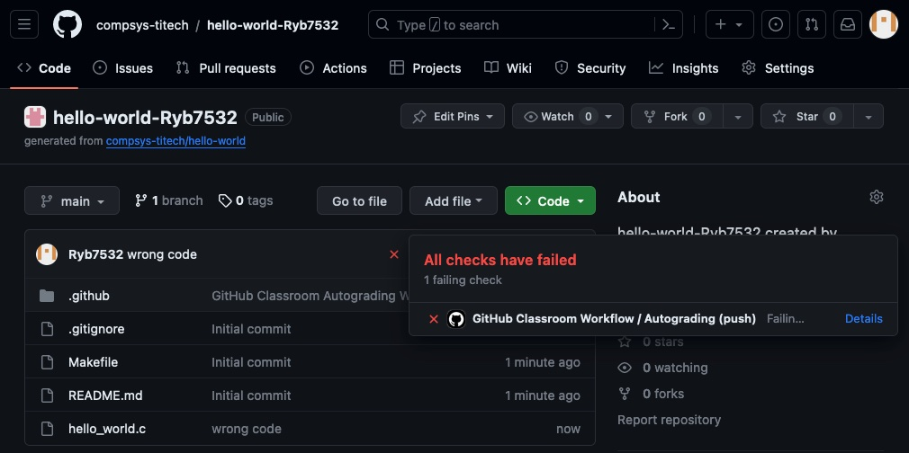
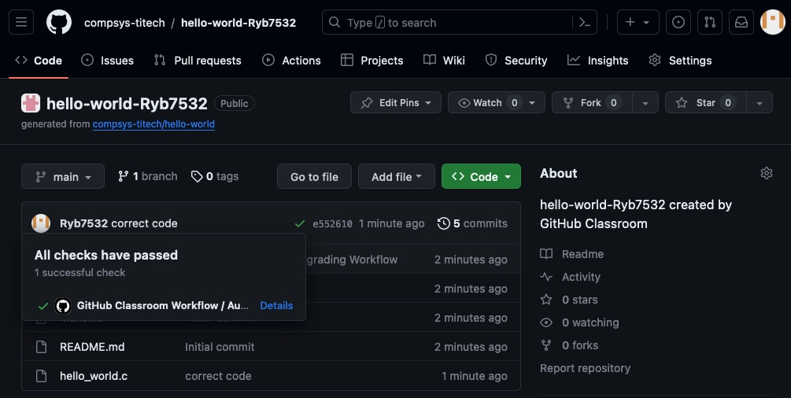

# hello_world

## 目次

[レポジトリについて](#repo)  
[Git基本操作について](#git)


## <a id="repo"></a>レポジトリについて

課題提出のデモンストレーション用レポジトリ  
TODO: 標準出力（画面）に"Hello World!"と出力する

### プログラムのコンパイル方法

以下のコマンドを実行するとコンパイルでき、実行ファイルhello_worldが作成されます
```
make
```

### 実行方法

```
./hello_world
```

## <a id="git"></a>Git基本操作について



### 課題提出までの流れ

1. レポジトリをローカルに取得
1. ファイルを編集
1. 変更したファイルをインデックスに追加
1. コミットを作成
1. リモートに変更内容をプッシュ

実行例
```
git clone https://github.com/compsys-titech/hello-world-Ryb7532.git
cd hello-world-Ryb7532

# ファイルの編集

git add .
git commit -m "solve the assignment"
git push
```

### 提出コードのステータスを確認

コミットログでも確認できます

#### 判定待ち



#### 失敗



#### 成功




